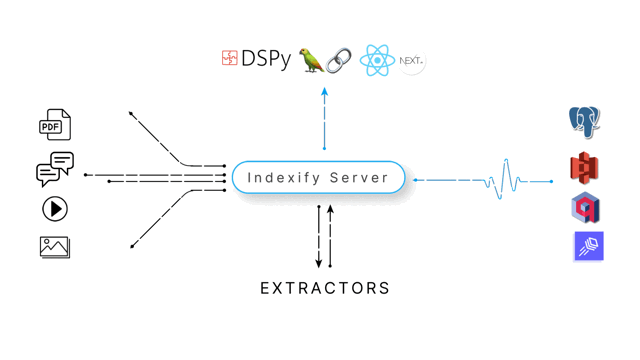

# Effortless Ingestion and Extraction for AI Applications at Any Scale



Indexify is a data framework designed for building ingestion and extraction pipelines for unstructured data. These pipelines are defined using declarative configuration. Each stage of the pipeline can perform structured extraction using any AI model or transform ingested data. The pipelines start working immediately upon data ingestion into Indexify, making them ideal for interactive applications and low-latency use cases.

## How It Works

##### Setup Ingestion Pipelines

Indexify provides a declarative configuration approach. You can translate the code above into a pipeline like this,
```yaml
name: 'pdf-ingestion-pipeline'
extraction_policies:
- extractor: 'tensorlake/markdown'
  name: 'pdf_to_markdown'
- extractor: 'tensorlake/ner'
  name: 'entity_extractor'
  content_source: 'pdf_to_markdown'
- extractor: 'tensorlake/minilm-l6'
  name: 'embedding'
  content_source: 'pdf_to_markdown'
```

1. Data extraction/transformation code are written as an `Extractor` and referred in any pipelines. Extractors are just functions under the hood that take data from upstream source and spits out transformed data, embedding or structured data. 

2. The extraction policy named `pdf_to_markdown` converts every PDF ingested into markdown. The extraction policies, `entity_extractor` and `pdf_to_markdown` are linked to `pdf_to_markdown` using the `content_source` attribute, which links downstream extraction policies to upstream. 

3. We have written some ready to use extractors. You can write custom extractors very easily to add any data extraction/transformation code or library.

##### Upload Data 
```python
client = IndexifyClient()

files = ["file1.pdf", .... "file100.pdf"]
for file in files:
  client.upload_file("pdf-ingestion-pipeline", file)
```

##### Retrieve
Retrieve extracted data from extraction policy for the uploaded document.
```python
content_ids = [content.id for content in client.list_content("pdf-ingestion-pipeline")]

markdown = client.get_extracted_content(content_ids[0], "pdf-ingestion-pipeline", "pdf_to_markdown")
named_entities = client.get_extracted_content(content_ids[0], "pdf-ingestion-pipeline", "entity_extractor")
```

Embeddings are automatically written into configured vector databases(default: lancedb).
You can search by 
```python
results = client.search("pdf-ingestion-pipeline.embedding.embedding","Who won the 2017 NBA finals?", k=3)
```

## Multi-Modal 
Indexify can parse PDFs, Videos, Images and Audio. You can use any model under the sun to extract data in the pipelines. We have written some ourselves, and continue to add more. You can write new extractors that wrap any local model or API under 5 minutes.

## Highly Available and Fault Tolerant
Most LLM data frameworks for unstructured data are primarily optimized for prototyping applications. A typical MVP data processing pipeline is written as follows -
```python
data = load_data(source)
embedding = generate_embedding(data) 
structured_data = structured_extraction_function(data)
db.save(embedding)
db.save(structured_data)
```
All of these lines in the above code snippet **can and will** [fail in production](https://www.somethingsimilar.com/2013/01/14/notes-on-distributed-systems-for-young-bloods/). If your application relies on your data framework being reliable and not losing data, you will inevitably lose data in production with LLM data frameworks designed for prototyping MVPs.

Indexify is distributed on many machines to scale-out each of the stages in the above pipeline. The pipeline state is replicated across multiple machines to recover from hardware failures, software crashes of the server. You get predictable latencies and throughput for data extraction, and it's fully observable to help troubleshoot. 


## Local Experience
Indexify runs locally without **any** dependencies. The pipelines developed and tested on laptops can run unchanged in production.

You should use Indexify if - 

1. You are working with non-trivial amount of data, >1000s of documents, audio files, videos or images. 
2. The data volume grows over time, and LLMs need access to updated data as quickly as possible
3. You care about reliability and availability of your ingestion pipelines. 

## Start Using Indexify

Dive into [Getting Started](getting_started.md) to learn how to use Indexify.

If you would like to learn some common use-cases - 

1. Learn how to build ingestion and extraction pipelines for [RAG Applications](usecases/rag.md)
2. Extract [PDF](usecases/pdf_extraction.md), [Videos](usecases/video_rag.md) and [Audio](usecases/audio_extraction.md) to extract embedding and [structured data](usecases/image_retrieval.md).

## Features

* Makes Unstructured Data **Queryable** with **SQL** and **Semantic Search**
* **Real Time** Extraction Engine to keep indexes **automatically** updated as new data is ingested.
* Create **Extraction Graph** to create multi-step workflows for **data transformation**, **embedding** and **structured extraction**.
* **Incremental Extraction** and **Selective Deletion** when content is deleted or updated.
* **Extractor SDK** allows adding new extraction capabilities, and many readily available extractors for **PDF**, **Image** and **Video** indexing and extraction.
* **Multi-Tenant** from the ground up, **Namespaces** to isolate sensitive data.
* Works with **any LLM Framework** including **Langchain**, **DSPy**, etc.
* Runs on your laptop during **prototyping** and also scales to **1000s of machines** on the cloud.
* Works with many **Blob Stores**, **Vector Stores** and **Structured Databases**
* We have even **Open Sourced Automation** to deploy to Kubernetes in production.

